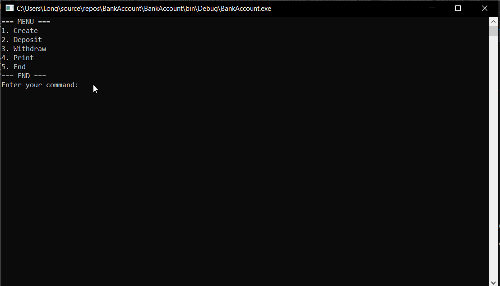

# Lab-1-Defining-Classes
## Problem 3. Test Client
Create a test client that tests your BankAccount class. 
Support the following commands: 
•	Create {Id} 
•	Deposit {Id} {amount} 
•	Withdraw {Id} {amount} 
•	Print {Id} 
•	End 
If you try to create an account with an existing Id, print "Account already exists". 
If you try to perform an operation on a non-existing account, print "Account does not exist". 
If you try to withdraw an amount larger than the balance, print "Insufficient balance". 
The Print command should print "Account ID{id}, balance {balance}". Round the balance to the second digit after the decimal separator. 

